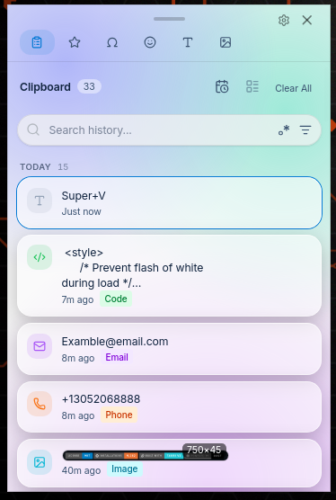
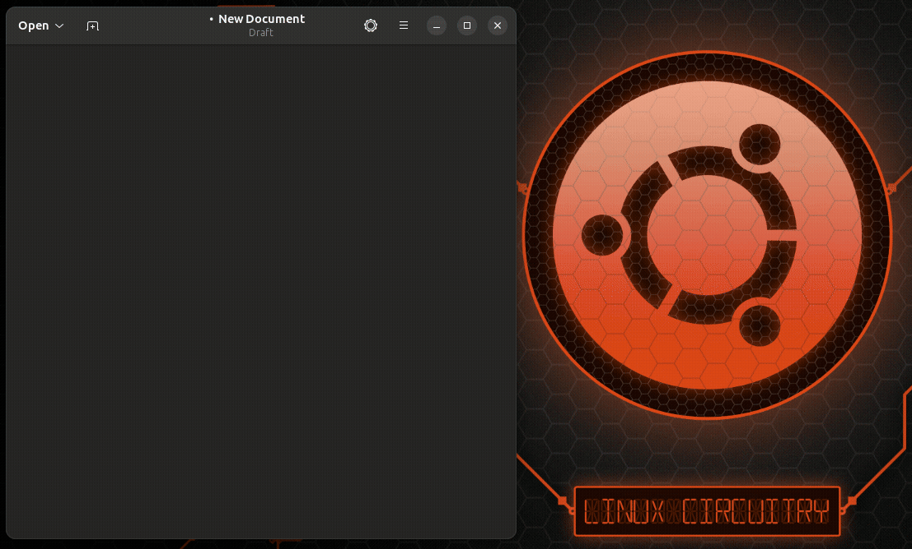
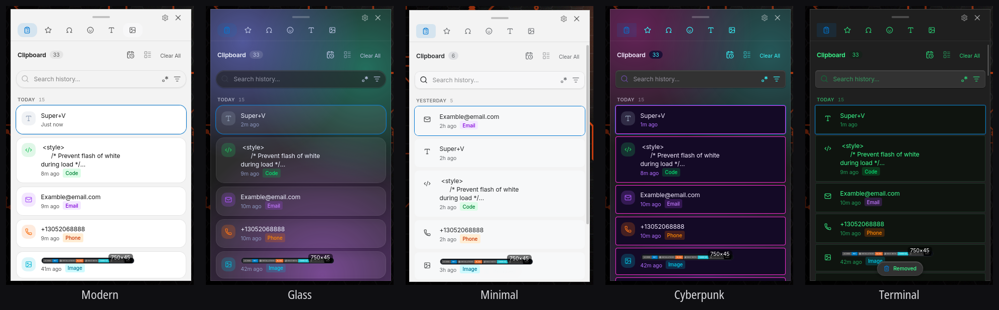

<div align="center">


# PenguinClip

### Fast, private clipboard history for Linux.

**The Windows Clipboard experience, reimagined for Linux.**

[](LICENSE)
[](https://github.com/techbysakh963/PenguinClip/releases/latest)
[](https://github.com/techbysakh963/PenguinClip/releases)
[](#installation)
[](#installation)
[](https://tauri.app)
[](https://www.rust-lang.org)
[](#privacy)
[](#privacy)

<br>



</div>

---

## Why PenguinClip?

Press **`Super+V`**, find anything you've ever copied, and paste it — in seconds. PenguinClip brings the clipboard history you know from Windows to Linux, with a faster search and a cleaner design, and **nothing ever leaves your machine**.

✓ **Find anything you've copied in seconds**
✓ **100% local and private** — no accounts, no cloud, no telemetry
✓ **Works on Wayland and X11**
✓ **Keyboard-first** — search, navigate, and paste without the mouse
✓ **Themeable and customizable**
✓ **No subscriptions, no sign-up, no tracking**

---

## See it in action

<div align="center">



<sub><b>Super+V → type → pick a result → Enter → pasted.</b></sub>

</div>

---

## Features

### 🔍 Instant search
Fuzzy search across your entire history with **match highlighting** and **smart relevance ranking**, so the result you want is the first one you see.

### 🗂️ Timeline & smart categories
History auto-groups by **Today / Yesterday / Last 7 Days / Older**, and PenguinClip recognizes **links, code, colors, numbers, emails, and images** automatically — filter to exactly the type you need.

### ⌨️ Keyboard-first
**Search, navigate, and paste without touching the mouse.** Type to search, arrow through results, press Enter to paste.

### 🔒 Privacy-first
**Local-only storage. No telemetry. No cloud.** Exclude sensitive patterns so they're never recorded.

### 🎨 Themes
Make it yours — **Modern**, **Glass**, **Minimal**, **Cyberpunk**, and **Terminal**, each with light and dark modes and a custom accent color.

---

## Themes

<div align="center">



</div>

---

## Installation

Download the latest **`.deb`**, **`.rpm`**, or **`.AppImage`** from the **[Releases page](https://github.com/techbysakh963/PenguinClip/releases/latest)**.

<details open>
<summary><b>Debian / Ubuntu (.deb)</b></summary>

```bash
sudo apt install ./penguinclip_1.2.1_amd64.deb
```
</details>

<details>
<summary><b>Fedora / openSUSE (.rpm)</b></summary>

```bash
sudo dnf install ./penguinclip-1.2.1-1.x86_64.rpm
```
</details>

<details>
<summary><b>AppImage (any distro)</b></summary>

```bash
chmod +x penguinclip_1.2.1_amd64.AppImage
./penguinclip_1.2.1_amd64.AppImage
```
</details>

> **Auto-paste permission (optional):** to paste directly into apps, PenguinClip needs `/dev/uinput` access. Without it, items still copy to your clipboard — you just press Ctrl+V yourself. The first-run Setup Wizard can configure this, or run:
> ```bash
> sudo setfacl -m u:$USER:rw /dev/uinput
> ```

---

## Usage

| Hotkey | Action |
| :--- | :--- |
| **`Super+V`** | Open clipboard history |
| **`Super+.`** | Open emoji picker |
| **`Ctrl+Alt+V`** | Alternative shortcut |
| **`↑ / ↓ / Tab`** | Navigate items |
| **`Enter`** | Paste selected item |
| **`Esc`** | Close window |

Type while the window is open to search instantly. Pin or favorite items to keep them; delete or clear what you don't need.

**Tabs:** Clipboard · Favorites · GIFs · Emoji · Kaomoji · Symbols

---

## Privacy

PenguinClip is **private by design**:

- **Everything stays on your machine** — clipboard history is stored locally, never uploaded.
- **No telemetry, no analytics, no accounts.**
- **No external network calls** without an explicit opt-in.
- **Exclusion rules** let you keep matching content (passwords, tokens) out of history entirely.

100% local · MIT licensed · Developed by **SAKH**.

---

<details>
<summary><b>GIF search (opt-in, bring your own key)</b></summary>

GIF search is **disabled by default** and never bundled with a key. To enable it, add your own [Tenor API key](https://developers.google.com/tenor/guides/quickstart) in **Settings → GIF Integration**. When enabled, search queries go to Google's Tenor API (your IP and search terms are visible to Google).

</details>

<details>
<summary><b>Security</b></summary>

- All clipboard data stored locally; no telemetry or analytics.
- No external API calls without explicit opt-in.
- Restrictive Content Security Policy.
- CI/CD actions pinned to immutable commit SHAs.
- Full audit: [SECURITY_AUDIT.md](SECURITY_AUDIT.md) · Report issues: [.github/SECURITY.md](.github/SECURITY.md)

</details>

<details>
<summary><b>Build from source</b></summary>

```bash
git clone https://github.com/techbysakh963/PenguinClip.git
cd PenguinClip
make deps
make rust
make node
source ~/.cargo/env
make build
sudo make install
```

**Requirements:** Rust 1.77+, Node.js 20+

There's also a review-then-run install script:
```bash
curl -fsSLO https://raw.githubusercontent.com/techbysakh963/PenguinClip/main/scripts/install.sh
less install.sh
bash install.sh
```
> The installer **refuses** to run when piped from `curl`. This is intentional.

</details>

<details>
<summary><b>Development</b></summary>

```bash
git clone https://github.com/techbysakh963/PenguinClip.git
cd PenguinClip
make deps
make dev
```

| Command | Description |
|---------|-------------|
| `make dev` | Development mode with hot reload |
| `make build` | Production build |
| `make install` | Install to system |
| `make uninstall` | Remove from system |
| `make lint` | Run linters |
| `make check-deps` | Verify dependencies |

**Stack:** Tauri v2 · Rust · React + TypeScript · Tailwind CSS.

</details>

<details>
<summary><b>Attribution</b></summary>

PenguinClip is a hardened, redesigned fork of [Windows-11-Clipboard-History-For-Linux](https://github.com/techbysakh963/Windows-11-Clipboard-History-For-Linux), originally created by [Gustavo Sett](https://github.com/gustavosett) and contributors, under the MIT License. This fork preserves the same license and full attribution to the original authors.

</details>

---

## License

MIT License — see [LICENSE](LICENSE).

Original work © 2024 Windows 11 Clipboard History For Linux Contributors.
Fork modifications © 2025–2026 PenguinClip Contributors — Developed by **SAKH**.
